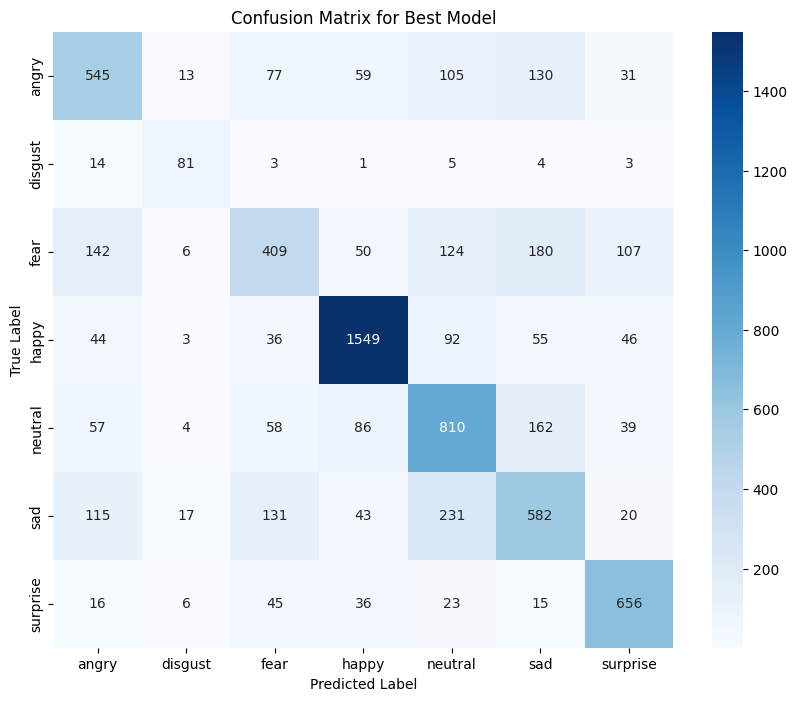
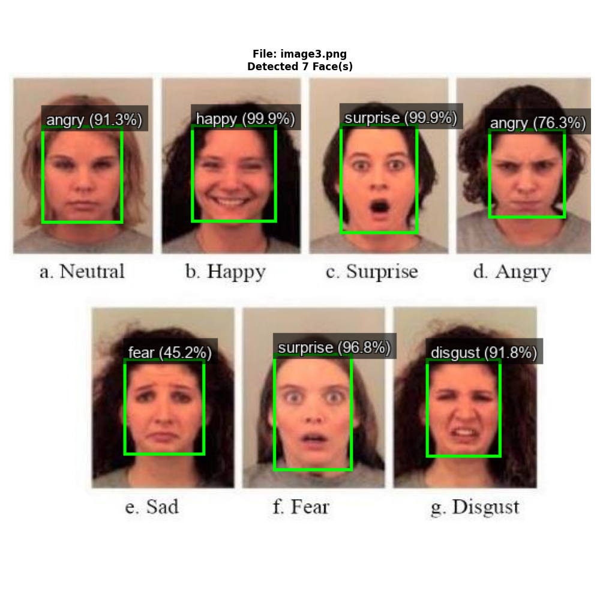
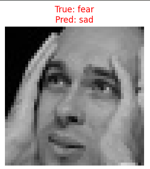
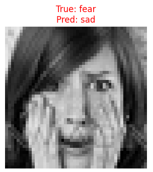
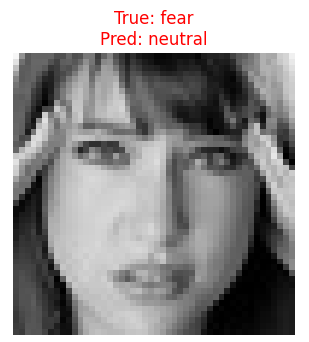
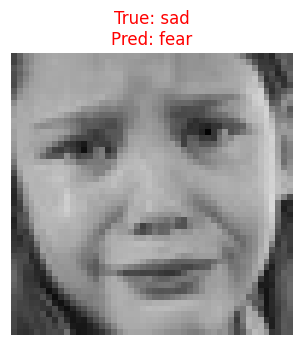
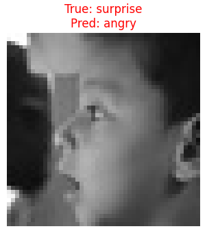

# Deciphering Feelings: A Real-time Facial Emotion Recognition System

## 🌟 Welcome to the Emotional Frontier!

Emotions are the subtle language of the soul, expressed through a myriad of facial nuances. But can a machine truly *understand* what we feel? This project is a deep dive into that fascinating challenge, culminating in a real-time system that detects and labels emotions from a live webcam feed.

It's been a journey of learning, tweaking, and celebrating those small, hard-won victories – especially when our model finally figured out what 'disgust' actually looks like!

## 🤔 What Exactly is Emotion Detection?

At its core, facial emotion recognition is the task of identifying human emotions (like happy, sad, angry, surprised, etc.) from facial expressions captured in images or video. While it sounds straightforward, it's trickier than it seems. Humans themselves sometimes disagree on an emotion, especially with subtle expressions or poor image quality. Teaching a computer this human intuition requires a powerful blend of data and intelligent algorithms.

### How a Machine "Understands" Feelings: The Power of Computer Vision

Machines don't 'feel'. Instead, they perceive emotions as patterns in pixels. This is where **Computer Vision** comes in – a field that enables computers to "see" and interpret visual data. Our journey utilizes cutting-edge deep learning techniques to train models that can:

1.  **Spot a Face:** Pinpoint where a human face is located within an image or video frame.
2.  **Isolate the Expression:** Focus only on the facial region.
3.  **Classify the Emotion:** Determine which of the predefined emotion categories the expression belongs to.

## 🚀 Our Evolution: From Simple CNNs to Transformative Visions

Every machine learning journey begins with a first step, often a foundational one. We started with building a custom **Convolutional Neural Network (CNN)** from scratch. CNNs are excellent at processing image data, learning hierarchical features from pixels (edges, textures, shapes). This initial model served as a great learning ground, but it quickly became clear that a basic CNN on its own had its limitations, especially with a dataset as nuanced (and sometimes noisy!) as the one we were using (think of datasets like FER2013, known for its challenging, low-resolution images).

### The PyTorch Power-Up: Embracing Transfer Learning

To elevate our game, we pivoted to **PyTorch**, a powerful deep learning framework, and embraced **Transfer Learning**. Instead of training a model from zero, we leveraged `MobileNetV3-Large`. This pre-trained CNN already possessed a vast understanding of the visual world, having learned from millions of images on the ImageNet dataset. Our strategy involved:

1.  **Freezing:** Keeping most of MobileNetV3's pre-trained layers frozen, preserving its powerful feature extraction capabilities.
2.  **Replacing the Head:** Swapping out its final classification layer with a new one tailored for our 7 emotion categories.
3.  **Fine-tuning:** Gently updating the new head (and later, a few of MobileNet's deeper layers) with our emotion dataset.

#### The First Roadblock: The Elusive "Disgust" 🤢

Our initial MobileNetV3 model hit a snag: the 'disgust' emotion. It simply **never predicted 'disgust'** for any test sample, resulting in a frustrating **0.00 F1-score**. This highlighted a common problem: **class imbalance**. Some emotions (like 'happy') were abundant, while others (like 'disgust') were very rare in the dataset. The model learned to ignore the rare ones because it could achieve higher overall accuracy by focusing on the prevalent classes.

#### The Rescue: Weighted Loss

To combat this, we introduced **Weighted Cross-Entropy Loss**. This clever technique tells the model: "Hey, errors on 'disgust' are much more costly than errors on 'happy'!" By assigning higher penalties for misclassifying minority classes, we forced the model to pay attention to them. This significantly improved the F1-score for 'disgust' and other low-support emotions, making our model fairer, even if overall accuracy saw a slight dip initially.

### The Leap to Transformers: Unlocking Global Understanding 🚀

While MobileNetV3 did a great job, we wanted to push the boundaries further. Traditional CNNs excel at local patterns. But what if the model could understand **global relationships** across an entire face simultaneously?

Enter the **Vision Transformer (ViT)**. Inspired by breakthroughs in natural language processing, ViTs break images into patches and use **attention mechanisms** to understand how every part of the face relates to every other part. This global perspective is incredibly powerful.

It wasn't just a model swap; it was a deeper dive into fine-tuning:

*   **Deeper Fine-tuning:** We specifically allowed the last few layers of the ViT's powerful 'encoder' (its core learning component) to adapt to our emotion data, alongside the classification head.
*   **Enhanced Data Augmentation:** We introduced a wider variety of transformations (rotations, color jitters, perspective distortions, random crops) to make the model incredibly robust to real-world variations.
*   **Lower Learning Rate & Scheduler:** With more layers adapting, we used a much smaller learning rate and an adaptive scheduler to ensure stable, effective learning without "unlearning" the ViT's valuable pre-trained knowledge.

#### The Result? A Leap! 📈

This comprehensive approach delivered a significant breakthrough: our Vision Transformer model achieved a peak validation accuracy of **over 65%**! More importantly, it showed vastly improved performance across all individual emotion categories, with 'disgust' now having a respectable F1-score and 'happy' and 'surprise' hitting excellent marks.

## ✨ Key Features

This repository provides everything you need to run your own emotion detection:

*   **Emotion Classification:** Accurately classifies 7 universal emotions: angry, disgust, fear, happy, neutral, sad, surprise.
*   **Face Detection:** Integrates a fast OpenCV DNN face detector to locate faces in images or video streams.
*   **Real-time Webcam Analysis:** Applies the trained model to live video, displaying predicted emotions overlaid on faces.
*   **Transfer Learning with ViT:** Leverages the power of pre-trained Vision Transformers for high performance.
*   **Robust Training:** Includes techniques like weighted loss and fine-tuning for challenging datasets.

## 📦 Getting Started

### Prerequisites

Before you begin, ensure you have the following installed:

*   **Python 3.8+**
*   **pip** (Python package installer)

### Installation

1.  **Clone the Repository:**
    ```bash
    git clone https://github.com/Samarth-3910/Emotion-Detection
    cd Emotion-Detection
    ```

2.  **Download Face Detector Models:**

    Our real-time system uses pre-trained OpenCV DNN face detection models. Download these two files:(click on links)
    *   [`deploy.prototxt.txt`](https://github.com/opencv/opencv/blob/master/samples/dnn/face_detector/deploy.prototxt)
    *   [`res10_300x300_ssd_iter_140000.caffemodel`](https://github.com/opencv/opencv_3rdparty/raw/dnn_samples_face_detector_20170830/res10_300x300_ssd_iter_140000.caffemodel)

    Place them in the specified path: Update the `FACE_DETECTOR_PROTO` and `FACE_DETECTOR_MODEL` paths in `webcam_emotion_detector.py` and `image_input.py` to match your chosen location).

3.  **Prepare Your Dataset:**
    Your emotion images should be organized into `images/train` and `images/test` directories, with each emotion as a dedicated subfolder. This structure is automatically recognized by `torchvision.datasets.ImageFolder`.
    ```
    .
    ├── images/
    │   ├── train/
    │   │   ├── angry/
    │   │   ├── disgust/
    │   │   ├── fear/
    │   │   ├── happy/
    │   │   ├── neutral/
    │   │   ├── sad/
    │   │   └── surprise/
    │   └── test/
    │       ├── angry/
    │       ├── disgust/
    │       ├── fear/
    │       ├── happy/
    │       ├── neutral/
    │       ├── sad/
    │       └── surprise/
    ├── models/
    │   └── best_emotion_vit.pth  <- Will be saved here after training
    ├── webcam_emotion_detector.py
    ├── image_input.py
    ├── your_training_script_name.py  <- Or your Jupyter Notebook
    └── requirements.txt
    ```

### Training the Model
    
The heart of any deep learning project lies in its training phase, where the model truly learns to decipher emotions. This process involves feeding the model vast amounts of data, allowing it to adjust its internal parameters until it can accurately recognize patterns associated with each emotion.

Whether you're running this in a dedicated Python script (`your_training_script_name.py`) or leveraging the interactive environment of a Jupyter Notebook, the steps are designed for clarity and control.

1.  **Ensure Your Environment is Set Up:**
    Before we embark on training, we need to ensure our Python environment has all the necessary tools installed.

    #### Understanding `requirements.txt`
    Think of `requirements.txt` as your project's precise shopping list for Python libraries. It's a plain text file that specifies all the exact software "ingredients" (libraries) and their versions that this project needs to run smoothly and consistently.

    *   **Purpose:** It's our blueprint for reproducibility. When you or anyone else sets up this project, `requirements.txt` guarantees that you're all using the same library versions. This prevents frustrating "it works on my machine!" issues and ensures reliable performance.
    *   **What it does:** When you run the installation command, `pip` automatically reads this file and downloads/installs everything listed within it.
    *   **Outcome:** You'll have all the essential tools perfectly aligned:
        *   `torch`, `torchvision`: The powerful backbone for building and running our deep learning models.
        *   `numpy`, `Pillow`: Essential for efficient numerical operations and robust image handling.
        *   `scikit-learn`: Provides invaluable tools for evaluating our model, like the detailed classification report.
        *   `tqdm`: A delightful little library that gives us a clear progress bar, keeping us updated on training progress.
        *   `opencv-python`: Crucial for real-time video capture, pre-processing, and accurate face detection.

    To install everything:
    ```bash
    pip install -r requirements.txt
    ```

    **Special Note for GPU Users:** The command `pip install torch torchvision` from `requirements.txt` typically installs the CPU-only version of PyTorch. If you have an NVIDIA GPU and want to drastically speed up training, **you must install PyTorch with CUDA support specifically**. Visit the official [PyTorch Get Started](https://pytorch.org/get-started/locally/) page and follow their instructions to get the correct command for your CUDA version. It will look something like this (example for CUDA 11.8):
    `pip install torch torchvision torchaudio --index-url https://download.pytorch.org/whl/cu118`

2.  **Dataset Preparation:**
    Ensure your emotion images are organized into `images/train` and `images/test` directories, with each emotion as a dedicated subfolder. This structure is automatically recognized by PyTorch's `ImageFolder` dataset loader.

3.  **Configure Your Training Script/Notebook:**
    Open your training script (`your_training_script_name.py`) or your Jupyter Notebook. Here, you'll find the core configurations for the model:
    *   `FINE_TUNED_VIT_BLOCKS`: This is crucial! Make sure this number exactly matches how many Vision Transformer encoder blocks you chose to unfreeze during the fine-tuning process. (From our discussions, `4` was a very effective choice).
    *   `NUM_EPOCHS`: This determines how many full passes the model makes over the entire training dataset. (We found `30` or `50` epochs to be effective).
    *   `LEARNING_RATE`: This controls the step size the model takes as it learns. (A small value like `5e-6` proved effective for fine-tuning our ViT).

4.  **Initiate Training (The Magic Moment!):**

    *   **If you're using a Jupyter Notebook:**
        1.  Navigate to your project's root directory in your terminal (or CMD/PowerShell on Windows) and launch Jupyter: `jupyter notebook`.
        2.  Open your training notebook (`your_training_notebook.ipynb`).
        3.  Execute each code cell sequentially, from top to bottom. Each cell builds upon the previous one: setting up the device, loading data, configuring the model architecture, and finally, starting the training loop.
        4.  When you execute the cell containing the `train_model` function call, the training will begin!

    *   **If you're using a standalone Python script:**
        1.  Open your terminal or command prompt (CMD/PowerShell on Windows).
        2.  Navigate to your project's root directory.
        3.  Simply run the script: `python your_training_script_name.py`.

5.  **Monitor the Learning Process (Live Feedback!):**
    As training progresses, your console (or Jupyter output) will provide real-time updates. This is where the `tqdm` library shines!

    **Understanding the Console Output (Tqdm Progress):**
    For each epoch, you'll see a line like this:
    ```
    Epoch X/Y [Train]: 100%|██████████████████████████████████████████████████████████████████████████████████████████████████████████████████████████████████████▉ | 862/901 [06:03<00:16, 2.42it/s, acc=0.4192, loss=1.1535]
    ```
    And after each full epoch, a summary block:
    ```
    Epoch X/Y
      Train: Loss: X.XXXX, Acc: X.XXXX
      Val  : Loss: X.XXXX, Acc: X.XXXX, Prec: X.XXXX, Rec: X.XXXX, F1: X.XXXX
    Best model saved with accuracy: X.XXXX
    ```

    *   **Epoch Progress Bar:** The `tqdm` bar (`████`) shows how far along the current epoch's processing is. You'll see the number of batches processed (`862/901`) and the time elapsed/remaining.
    *   **`it/s` (Iterations per second):** Indicates your training speed – how many batches your model processes per second.
    *   **`acc` & `loss` (on the progress bar):** These are the *current average* accuracy and loss for the batches processed so far within that specific epoch.
    *   **`Train: Loss` & `Acc` (after epoch):** These are the final training metrics for the entire epoch. You want `Loss` to consistently drop and `Acc` to steadily rise.
    *   **`Val : Loss` & `Acc`, `Prec`, `Rec`, `F1` (after epoch):** This is the critical part! It shows how well the model *generalizes* to data it has *never seen before*. We want `Val : Loss` to decrease and `Val : Acc` to increase. The closer `Val : Acc` is to `Train : Acc` (without `Val : Acc` dropping significantly while `Train : Acc` soars), the better our model is generalizing, and the less it's overfitting.
    *   **`Best model saved with accuracy: X.XXXX`**: This vital message confirms that your model has achieved a new personal best in validation accuracy for this run. Our system automatically saves the model's "brain" (its optimized weights) at this point, ensuring you always retain the highest-performing version!

6.  **Training Completion:**
    Once all epochs are finished, a "Training complete" message will appear, followed by a detailed `--- Final Evaluation on Test Set ---` classification report. This report summarizes your model's ultimate performance across all emotion classes, giving you the comprehensive picture of its capabilities.

    The `.pth` file saved in your `models/` directory (e.g., `best_emotion_vit.pth`) contains the learned "brain" of your model – its optimized weights. This is the file you'll use for all future predictions and real-time detection!

## 📊 Results & Performance

Our journey culminated in a robust Vision Transformer model that achieved a peak validation accuracy of **65.55%** on the challenging FER2013-like dataset. This is a highly competitive result for a 7-class emotion recognition task.

More importantly, the model demonstrates balanced and strong performance across individual emotion categories. Below is the final classification report from our best training run:

| Class    | Precision | Recall | F1-Score | Support |
| :------- | :-------- | :----- | :------- | :------ |
| angry    | 0.5780    | 0.5594 | **0.5686** | 960     |
| disgust  | 0.6220    | 0.7117 | **0.6639** | 111     |
| fear     | 0.5245    | 0.4204 | **0.4667** | 1018    |
| happy    | 0.8522    | 0.8433 | **0.8477** | 1825    |
| neutral  | 0.5899    | 0.6530 | **0.6198** | 1216    |
| sad      | 0.5087    | 0.5127 | **0.5107** | 1139    |
| surprise | 0.7304    | 0.8193 | **0.7723** | 797     |
|          |           |        |          |         |
| **accuracy** |           |        | **0.6530** | 7066    |
| **macro avg** | **0.6294** | **0.6457** | **0.6357** | 7066    |
| **weighted avg** | **0.6499** | **0.6530** | **0.6500** | 7066    |

**The 'disgust' success story:** Notice the impressive **0.6639 F1-score** for the 'disgust' class! This was a major challenge, starting at 0.00 F1-score, and its significant improvement highlights the effectiveness of using weighted loss and fine-tuning with the Vision Transformer.

## 📸 Visuals of Emotions in Action

This is where our project truly comes alive! Beyond the summary numbers, seeing the model's progress and its decisions helps us understand its strengths and its learning opportunities.

*   **Training Progress Log: Witnessing the Learning Journey!**
    Instead of a dry plot, we're sharing a direct snippet from our training console. This log provides a real-time peek into how our model evolved over 30 epochs.

    Each `Epoch` represents a full pass through our entire training dataset. For each epoch, you'll see:
    *   **`Train: Loss` & `Acc`**: These tell us how well the model is learning on the data it *sees* and trains on. We want to see `Loss` consistently dropping and `Acc` steadily rising.
    *   **`Val : Loss` & `Acc`**: This is the critical part! It shows how well the model *generalizes* to data it has *never seen before* (our validation set). We want `Val : Loss` to decrease and `Val : Acc` to increase. The closer `Val : Acc` is to `Train : Acc` (without `Val : Acc` dropping significantly while `Train : Acc` soars), the better our model is generalizing.
    *   **`Prec`, `Rec`, `F1` (for Validation):** These give us a deeper look at the model's performance beyond simple accuracy, especially important for handling different emotion classes.
    *   **`Best model saved with accuracy: X.XXXX`**: Our system wisely saves a snapshot of the model whenever its validation accuracy improves. This ensures we always keep the top-performing version, even if later epochs see a slight dip.

    Our log showcases a truly remarkable improvement. Observe how the validation accuracy steadily climbs, culminating in a strong peak (reaching `0.6555` at Epoch 24 in this particular run), demonstrating the power of the Vision Transformer and our fine-tuning strategy!

    ```
    Starting training...
                                                                                                                                                                                                                                      

    Epoch 1/30
      Train: Loss: 1.5401, Acc: 0.4246
      Val  : Loss: 1.3091, Acc: 0.5069, Prec: 0.5191, Rec: 0.5069, F1: 0.5034
    Best model saved with accuracy: 0.5069
                                                                                                                                                                                                                                      

    Epoch 2/30
      Train: Loss: 1.2630, Acc: 0.5329
      Val  : Loss: 1.1679, Acc: 0.5667, Prec: 0.5794, Rec: 0.5667, F1: 0.5659
    Best model saved with accuracy: 0.5667
    
    # ... (content removed for brevity, but imagine Epoch 3 to 20 here) ...

    Epoch 21/30
      Train: Loss: 0.5402, Acc: 0.7895
      Val  : Loss: 0.9724, Acc: 0.6533, Prec: 0.6471, Rec: 0.6533, F1: 0.6478
    Best model saved with accuracy: 0.6533
                                                                                                                                                                                                                                      

    Epoch 22/30
      Train: Loss: 0.5303, Acc: 0.7932
      Val  : Loss: 0.9717, Acc: 0.6527, Prec: 0.6507, Rec: 0.6527, F1: 0.6495
                                                                                                                                                                                                                                      

    Epoch 23/30
      Train: Loss: 0.5315, Acc: 0.7940
      Val  : Loss: 0.9762, Acc: 0.6510, Prec: 0.6525, Rec: 0.6510, F1: 0.6501
                                                                                                                                                                                                                                      

    Epoch 24/30
      Train: Loss: 0.5218, Acc: 0.7966
      Val  : Loss: 0.9746, Acc: 0.6555, Prec: 0.6516, Rec: 0.6555, F1: 0.6512
    Best model saved with accuracy: 0.6555
    
    # ... (content removed for brevity, but imagine Epoch 25 to 30 here) ...

    Training complete.
    Total training time: 14490.84 seconds
    ```
*   **Final Evaluation**    
    ```
    --- Final Evaluation on Test Set ---
                  precision    recall  f1-score   support

           angry     0.5780    0.5594    0.5686       960
         disgust     0.6220    0.7117    0.6639       111
            fear     0.5245    0.4204    0.4667      1018
           happy     0.8522    0.8433    0.8477      1825
         neutral     0.5899    0.6530    0.6198      1216
             sad     0.5087    0.5127    0.5107      1139
        surprise     0.7304    0.8193    0.7723       797

        accuracy                         0.6530      7066
       macro avg     0.6294    0.6457    0.6357      7066
    weighted avg     0.6499    0.6530    0.6500      7066
    ```

*   **Confusion Matrix: Unmasking Insights!**
    This visual map is more than just numbers; it tells us *how* our model is performing on each emotion, not just if it's right or wrong. It shows *what* emotions are most often confused for *which other* emotions.

    **How to Read It:**
    *   Each **row** represents the *actual* (true) emotion of the image.
    *   Each **column** represents the *emotion our model predicted*.
    *   The values on the **diagonal** (top-left to bottom-right) show the proportion of times the model got it *right* for that specific emotion. Higher values here mean better performance for that class!
    *   Values *off* the diagonal show misclassifications. For example, if the 'Fear' row has a high value in the 'Angry' column, it means actual 'Fear' expressions are often mistaken for 'Angry' by the model.
    *   The values are normalized (from 0.00 to 1.00), showing proportions. For example, 0.85 means 85% of images belonging to that true class were correctly predicted.

    Our matrix reveals some fascinating insights:
    *   `Happy` and `Surprise` are rockstars: Their high diagonal values (e.g., 0.84 for Happy, 0.82 for Surprise) confirm our model excels at identifying these clear expressions.
    *   `Disgust` is no longer invisible! A strong diagonal value of `0.71` (meaning 71% of actual 'disgust' faces were correctly identified) is a huge win, especially considering its initial 0.00 F1-score.
    *   Common confusions: We can see where expressions subtly blend. For instance, 'Fear' (`0.42` recall) might sometimes be mistaken for 'Sad' or 'Neutral', highlighting the dataset's inherent ambiguities. This matrix is an invaluable tool for understanding specific strengths and weaknesses of the model beyond a single accuracy score.

    
    

    *(Tip: This image is generated after training is done!)*

*   **Multi-Face Prediction: A Snapshot of Real-World Application**
    To demonstrate the system's ability to handle more complex scenarios, here's an image featuring multiple individuals. Our model processes each detected face independently, providing a unique emotion prediction for every person.

    *Image of multiple faces-* 

    **Detailed Predictions from the Scene:**

    *   **Face 1 (True: Neutral): Predicted as `Angry` (Confidence: 91.3%)**
        *   *Insight:* This highlights a challenging area. While the model strongly predicted 'Angry', the true label was 'Neutral'. This might be due to subtle cues, lighting, or an inherent ambiguity in the expression itself. The model's top 3 probabilities were `angry: 91.26%`, `sad: 7.16%`, `neutral: 1.12%`.
    *   **Face 2 (True: Happy): Predicted as `Happy` (Confidence: 99.9%)**
        *   *Insight:* A high-confidence and accurate prediction for our best-performing class. Top 3: `happy: 99.88%`, `neutral: 0.07%`, `surprise: 0.03%`.
    *   **Face 3 (True: Surprise): Predicted as `Surprise` (Confidence: 99.9%)**
        *   *Insight:* Another confident and accurate prediction for 'Surprise'. Top 3: `surprise: 99.89%`, `fear: 0.05%`, `happy: 0.03%`.
    *   **Face 4 (True: Angry): Predicted as `Angry` (Confidence: 76.3%)**
        *   *Insight:* A solid and confident correct prediction for 'Angry'. Top 3: `angry: 76.34%`, `sad: 18.45%`, `fear: 4.28%`.
    *   **Face 5 (True: Sad): Predicted as `Fear` (Confidence: 45.2%)**
        *   *Insight:* A more nuanced misclassification with lower confidence. 'Sad' and 'Fear' can share cues like lowered brows or strained expressions, making them hard to distinguish. Top 3: `fear: 45.20%`, `sad: 31.27%`, `neutral: 20.96%`.
    *   **Face 6 (True: Fear): Predicted as `Surprise` (Confidence: 96.8%)**
        *   *Insight:* A very common confusion pair! Both 'Fear' and 'Surprise' often involve wide eyes and an open mouth. The model chose 'Surprise' with high confidence. Top 3: `surprise: 96.80%`, `fear: 2.07%`, `angry: 0.79%`.
    *   **Face 7 (True: Disgust): Predicted as `Disgust` (Confidence: 91.8%)**
        *   *Insight:* A fantastic and confident correct prediction for our previously most challenging class! Top 3: `disgust: 91.79%`, `angry: 7.21%`, `sad: 0.56%`.

*   **Misclassified Image Predictions: A Closer Look at Specific Confusions:**
    Beyond the multi-face scene, these dedicated examples highlight typical challenges where our model, like even human observers, finds certain expressions difficult to definitively classify. This isn't a flaw, but a valuable insight into the inherent complexity of facial cues and potential dataset ambiguities.

    *   **True: Fear, Predicted: Sad:** A common overlap. Expressions of fear often involve raised inner eyebrows and a slightly open mouth, which can visually blend with cues for sadness, particularly if the fear is not extreme.
        *    

    *   **True: Fear, Predicted: Neutral:** Sometimes, a subtle fear expression, or tension around the eyes or mouth, might be interpreted as a neutral state by the model.
        *   

    *   **True: Sad, Predicted: Fear:** Conversely, sadness can involve brow furrowing or a general downturn that might be confused with mild fear, especially if the expression is not exaggerated.
        *   

    *   **True: Surprise, Predicted: Angry:** This is less common but can occur. A strong, sudden intake of breath or a wide-open mouth in surprise might be misread as an aggressive, open-mouthed angry expression, especially if accompanying eyebrow movements are ambiguous.
        *   

## 🔮 Future Enhancements (Always Room to Grow!)

While the current model is robust, here are areas for future exploration:

*   **More Advanced Architectures:** Experiment with even larger Vision Transformers (e.g., ViT-L, ViT-H) or newer, powerful architectures like ConvNeXt for potentially higher accuracy, if computational resources permit.
*   **Dataset Expansion/Refinement:** Incorporate more diverse emotion datasets or perform sophisticated data cleaning and re-labeling to further reduce label noise and improve consistency.
*   **Ensemble Methods:** Combine predictions from multiple trained models (e.g., different architectures or trained with different random seeds) to potentially achieve marginal accuracy gains.
*   **Quantization/Optimization:** For deployment on edge devices, explore model quantization or pruning to reduce model size and inference time without significant accuracy loss.
*   **Emotion Intensity:** Move beyond discrete emotion labels to predict the intensity of an emotion (e.g., slightly happy, very happy).

## 👏 Credits & Acknowledgements

*   **PyTorch & torchvision:** The foundational deep learning libraries that powered this project.
*   **OpenCV:** For robust video and image processing utilities, and the pre-trained face detection model.
*   **scikit-learn:** For powerful model evaluation metrics.
*   **PIL (Pillow):** For advanced image manipulation and text rendering.
*   **tqdm:** For providing delightful progress bars during training.
*   **FER2013 Dataset:** (If this is the dataset you used, it's good practice to acknowledge it explicitly, as its characteristics shaped the project's challenges and solutions).   
[`Dataset`](https://www.kaggle.com/datasets/ananthu017/emotion-detection-fer)

---
